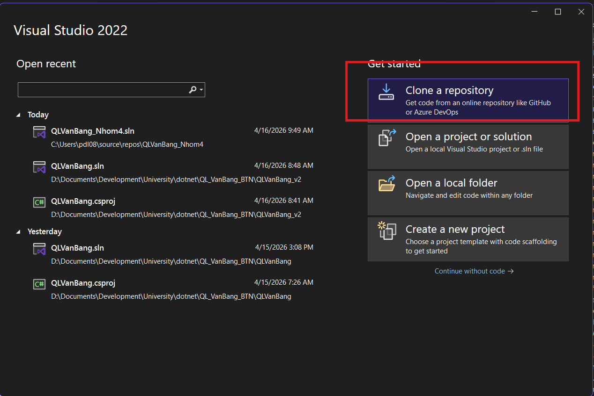
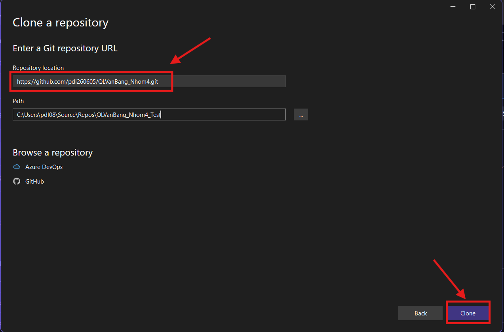
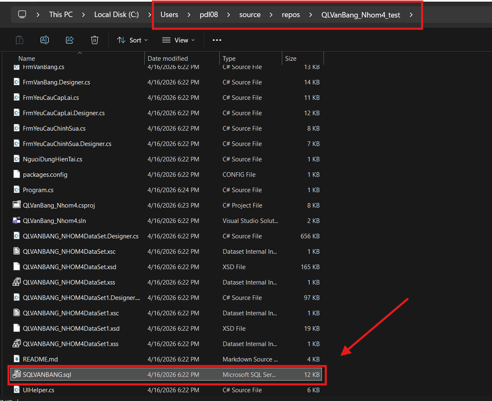
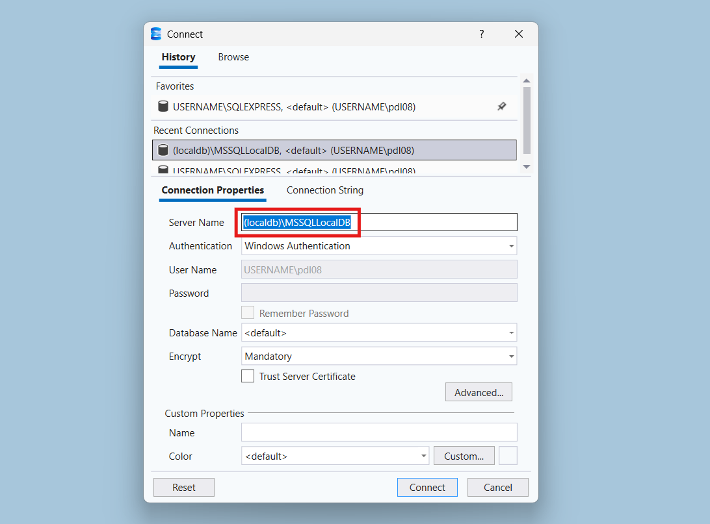
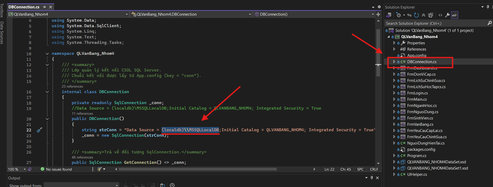

# 🎓 QLVanBang_Nhom4 – Hệ thống Quản lý Văn bằng Chứng chỉ

## Hướng dẫn clone bằng Visual studio
- Mở Visual studio chọn clone Repo


- Parse link repo vào Repository location và ần clone


- Mở thư mục đã clone về chạy file SQLVANBANG.sql


- Copy server name khi chạy kết nối local database


- Dán server name thay thế cho đoạn chuỗi này trong file DBConection.cs -> bấm lưu và F5 để chạy 

## 📌 Giới thiệu

QLVanBang_Nhom4 là ứng dụng **Windows Forms (.NET Framework)** dùng để quản lý:

* Sinh viên
* Văn bằng / chứng chỉ
* Ngành học
* Đơn vị cấp
* Lịch sử học tập
* Yêu cầu cấp lại / chỉnh sửa

Ứng dụng sử dụng **SQL Server (LocalDB)** làm hệ quản trị cơ sở dữ liệu.

---

## 🏗️ Cấu trúc project

```
QLVanBang_Nhom4/
│
├── DBConnection.cs            // Kết nối SQL Server
├── UIHelper.cs                // Style giao diện
├── NguoiDungHienTai.cs        // Session user
│
├── FrmLogin.cs                // Đăng nhập
├── FrmMain.cs                 // Form chính
├── FrmDashboard.cs
│
├── FrmSinhVien.cs
├── FrmNganhHoc.cs
├── FrmDonViCap.cs
├── FrmVanBang.cs
│
├── FrmLichSuHocTap.cs
├── FrmLichSuChinhSua.cs
├── FrmYeuCauCapLai.cs
├── FrmYeuCauChinhSua.cs
│
├── QLVANBANG_NHOM4DataSet.xsd
├── App.config
└── Program.cs
```

---

## ⚙️ Yêu cầu hệ thống

* Visual Studio 2019+
* .NET Framework (4.7 trở lên)
* SQL Server Express hoặc LocalDB

---

## 🗄️ Hướng dẫn tạo Database

### Bước 1: Mở SQL Server Management Studio (SSMS)

### Bước 2: Chạy file SQL

* Mở file:
  SQLVanBang.sql

* Nhấn **Execute**

✔ Sau khi chạy xong sẽ có database:
QLVANBANG_NHOM4

---

## 🔌 Cấu hình kết nối Database

File: DBConnection.cs

### Chuỗi kết nối mặc định:

```
string strConn = "Data Source=(localdb)\\MSSQLLocalDB;Initial Catalog=QLVANBANG_NHOM4;Integrated Security=True";
```
### Thay đổi chuỗi kết nối:
- Chỉ cần thay đổi Data Source nếu database vẫn có tên là QLVANBANG_NHOM4
```
string strConn = "Data Source=******;Initial Catalog=QLVANBANG_NHOM4;Integrated Security=True";
```

---

## 🛠️ Nếu bị lỗi không kết nối được

### 1. Kiểm tra Server Name

Mở SSMS → xem Server:

* (localdb)\MSSQLLocalDB (mặc định)
* hoặc:
  .\SQLEXPRESS
  localhost
  DESKTOP-XXXX\SQLEXPRESS

---

### 2. Sửa lại chuỗi kết nối

Ví dụ:

✔ LocalDB:
Data Source=(localdb)\MSSQLLocalDB;Initial Catalog=QLVANBANG_NHOM4;Integrated Security=True

✔ SQL Express:
Data Source=.\SQLEXPRESS;Initial Catalog=QLVANBANG_NHOM4;Integrated Security=True

✔ SQL Server login:
Data Source=.;Initial Catalog=QLVANBANG_NHOM4;User ID=sa;Password=123456

---

## ▶️ Cách chạy project

### Bước 1:

Mở project bằng Visual Studio

### Bước 2:

Build project:
Build → Build Solution

### Bước 3:

Chạy chương trình:
F5

---

## 🔐 Tài khoản mặc định

| Username  | Password  |
| --------- | --------- |
| admin     | Admin@123 |
| nhanvien1 | 123456    |

---

## ⚠️ Lỗi thường gặp & cách fix

### ❌ Không login được

✔ Kiểm tra:

* Hash password có đúng không
* Có dùng N'Admin@123' trong SQL không

---

### ❌ DataGridView không load dữ liệu

✔ Kiểm tra:

* Connection string đúng chưa
* Table có dữ liệu chưa
* Fill() có chạy không

---

### ❌ Lỗi UIHelper không tìm thấy

✔ Fix:

* Build lại project
* Clean + Rebuild

---

### ❌ Could not find type UIHelper

✔ Do:

* File chưa compile
* Namespace sai

---


